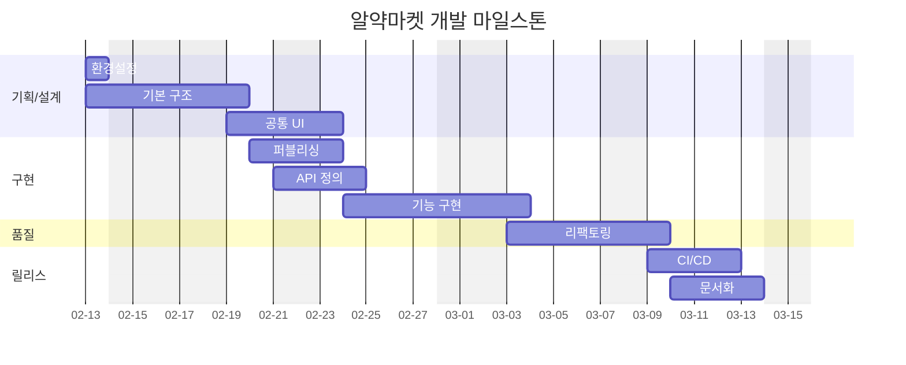
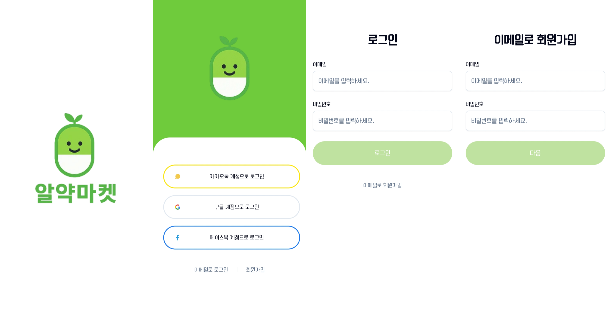
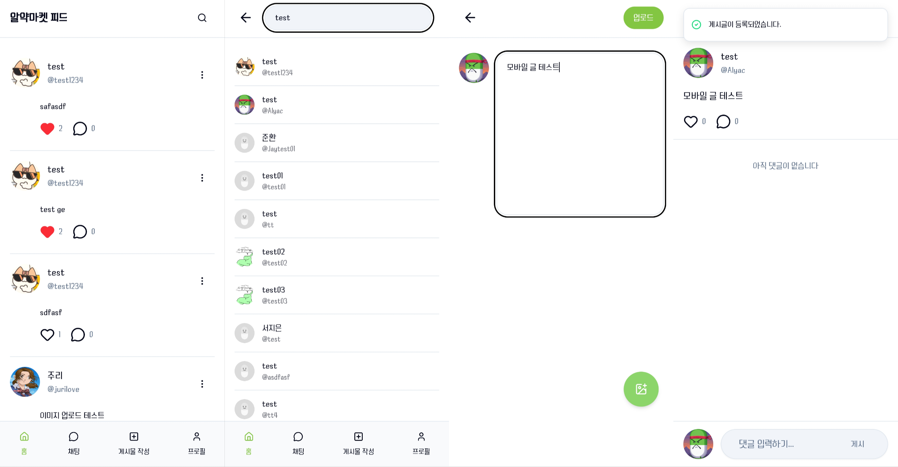
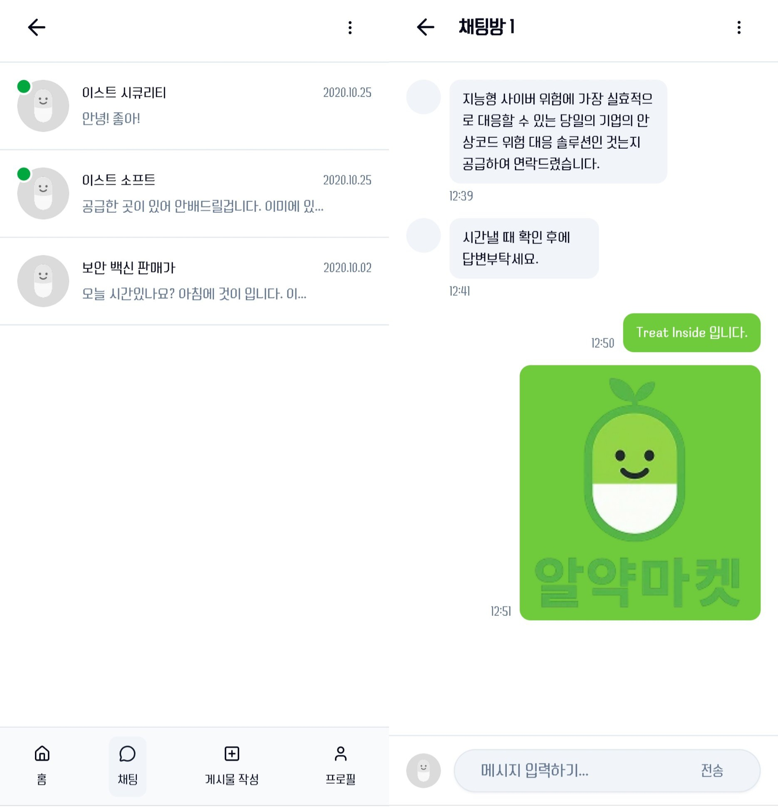
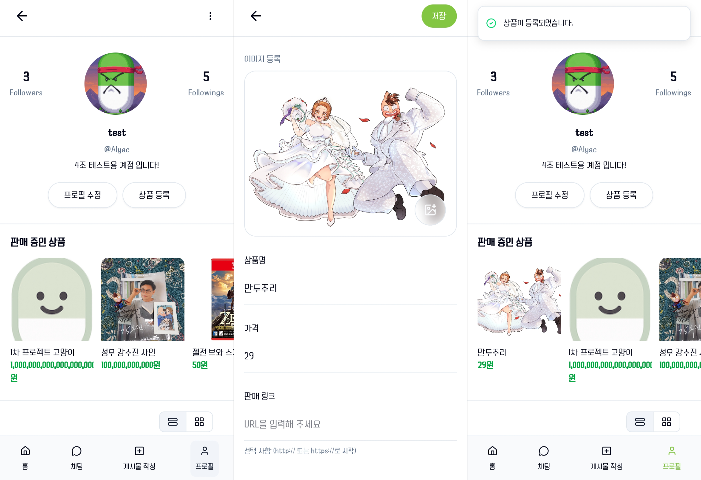

<p align="center">
  
</p>

<br>

# &nbsp; 4조 막내온탑 알약 마켓 &nbsp;

## 목차

- [프로젝트 소개](#프로젝트-소개)
- [프로젝트 구조](#프로젝트-구조)
- [주요 기능](#주요-기능)
- [미리보기](#미리-보기)
- [기술 스택](#기술-스택)
- [라우팅 구조](#라우팅-구조)
- [설치 및 실행 방법](#설치-및-실행-방법)
- [개선 아이디어](#개선-아이디어)
- [배포 URL](#배포-url)

<br>

<p align="center">
  
</p>

<a id="프로젝트-소개"></a>

## &nbsp; 프로젝트 소개

#### 1. 프로젝트 개요

- Alyac Market은 소셜 미디어 및 전자상거래 기능을 제공하는 웹 퍼블리싱 입니다. JWT 기반 인증, 게시글 관리, 팔로우 시스템, 상품 관리 등의 기능을 포함합니다.

#### 2. 팀원 소개

| 이름   | 역할 | 세부역할                | github url                             |
| ------ | ---- | -----------------------| -------------------------------------- |
| 정성민 | 팀장 | - 피드, 검색 카테고리   | https://github.com/sungminjung066-lang |
| 신영환 | 팀원 | - 프로필, 채팅 카테고리 | https://github.com/Catailog            |
| 박재영 | 팀원 | - 인증, 기타 카테고리   | https://github.com/wodud2626           |
| 김연화 | 팀원 | - 제품 카테고리         | https://github.com/yeonaa95            |


#### 3. 마일스톤



<br>

<a id="프로젝트-구조"></a>

## &nbsp; 프로젝트 구조

```
src
├── app
│   ├── routes / layouts / providers
│   └── App.tsx, main.tsx
│
├── pages
│   ├── home
│   ├── feed
│   ├── profile
│   ├── post
│   ├── product
│   ├── chat
│   └── auth (sign-in / sign-up)
│
├── widgets
│   ├── header / nav
│   ├── feed-list
│   ├── post-list
│   ├── comment-list
│   └── profile-card
│
├── features
│   ├── auth
│   ├── post
│   ├── product
│   ├── profile-actions
│   └── account-search
│
├── entities
│   ├── user
│   ├── profile
│   ├── post
│   ├── comment
│   ├── product
│   └── auth
│
└── shared
    ├── api
    ├── ui
    ├── assets
    └── lib

```

<br>

<a id="주요-기능"></a>

## &nbsp; 주요 기능

- **회원가입 / 로그인**
  - JWT 기반 인증을 통해 사용자 계정을 생성
  - 로그인

- **프로필 기능**
  - 사용자 프로필 조회
  - 프로필 이미지 및 정보 수정

- **팔로우 기능**
  - 다른 사용자를 팔로우
  - 팔로우 및 팔로잉 목록

- **검색 기능**
  - 사용자 계정을 검색

- **게시글 기능**
  - 게시글 작성, 수정, 삭제
  - 이미지 업로드 및 게시글 이미지 표시

- **좋아요 / 댓글 기능**
  - 게시글에 좋아요, 취소
  - 댓글 작성 및 삭제

- **상품 등록 및 거래**
  - 사용자가 판매할 상품을 작성, 수정, 등록
  - 이미지 업로드 및 게시글 이미지 표시

- **채팅 기능**
  - 채팅을 통한 메세지 전송

<br>

<a id="미리-보기"></a>

## &nbsp; 미리보기

- 로그인 및 회원가입 <br>
  

---

- 피드 및 게시글 작성 <br>
  

---

- 채팅 <br>
  

---

- 프로필 및 상품등록 <br>
  

<br>

<a id="기술-스택"></a>

## &nbsp; 기술 스택

#### Core

- **React** <br>
  : 확장성과 유지보수성이 높고, 활발하고 성숙한 생태계를 보유한 UI 라이브러리

- **TypeScript** <br>
  : 정적 타입을 통해 코드 안정성과 협업 효율 향상

- **Vite** <br>
  : 빠른 개발 서버와 빌드 속도로 개발 생산성 향상

---

#### State Management

- **Zustand** <br>
  : 간결한 API로 전역 상태 관리를 단순하게 구성

---

#### Server State & API

- **Axios** <br>
  : 공통 설정을 적용하여 API 호출 구조를 일관되게 관리

- **TanStack Query** <br>
  : 서버 상태 캐싱 및 비동기 데이터 관리를 통해 API 통신 효율 향상

---

#### Form & Validation

- **React Hook Form** <br>
  : 성능 중심의 폼 상태 관리

- **Zod** <br>
  : 스키마 기반 데이터 검증 및 TypeScript 타입 추론 지원

---

#### Routing

- **React Router** <br>
  : SPA 환경에서 페이지 라우팅 및 URL 관리

---

#### Styling & UI

- **Tailwind CSS** <br>
  : 유틸리티 기반 스타일링으로 빠른 UI 개발 가능

- **shadcn/ui** <br>
  : 접근성과 커스터마이징이 용이한 컴포넌트 라이브러리

- **lucide-react** <br>
  : 가볍고 일관된 아이콘 시스템 제공

---

#### Backend / BaaS

- **Firebase** <br>
  : BaaS 기반 백엔드 서비스로 빠른 개발 환경 제공 <br>
  NoSQL 구조의 유연성과 낮은 학습 곡선

---

#### Deployment

- **Vercel** <br>
  : 정적 사이트 배포 최적화 및 CI/CD 자동화 지원

<br>

<a id="라우팅-구조"></a>

##  라우팅 구조

| 경로                         | 설명             | 접근 권한 |
| ---------------------------- | ---------------- | --------- |
| `/`                          | 메인 홈          | 비로그인  |
| `/sign-in`                   | 로그인           | 비로그인  |
| `/sign-up`                   | 회원가입         | 비로그인  |
| `/profile-setting`           | 프로필 등록      | 비로그인  |
| `/feed`                      | 피드             | 로그인    |
| `/feed/search`               | 어카운트 검색    | 로그인    |
| `/chat`                      | 채팅 목록        | 로그인    |
| `/chat/:chatId`              | 채팅 디테일      | 로그인    |
| `/profile`                   | 프로필           | 로그인    |
| `/profile/:accountname`      | 다른 유저 프로필 | 로그인    |
| `/profile-update`            | 프로필 수정      | 로그인    |
| `/followers/:accountname`    | 팔로워           | 로그인    |
| `/followings/:accountname`   | 팔로잉           | 로그인    |
| `/post/:postId`              | 포스트 디테일    | 로그인    |
| `/post-create`               | 포스트 작성      | 로그인    |
| `/post-update/:postId`       | 포스트 수정      | 로그인    |
| `/product-create`            | 상품 작성        | 로그인    |
| `/product-update/:productId` | 상품 수정        | 로그인    |
| `*`                          | 404 에러         | 전체      |

<br>

<a id="설치-및-실행-방법"></a>

##  설치 및 실행 방법

#### 1. Clone Repository

: 레포지토리를 클론합니다.

```bash
git clone https://github.com/alyac-market-4/alyac-market-4.git
cd alyac-market-4
```

#### 2. Install Dependencies

: 프로젝트에 필요한 패키지를 설치합니다.

```bash
npm install
```

#### 3. Environment Variables

: 프로젝트 실행을 위해 `.env` 파일을 생성합니다.

```bash
cp .env.example .env
```

: 필요한 환경 변수 예시

```
VITE_API_BASE_URL=your_api_base_url
VITE_IMAGE_BASE_URL=your_image_base_url
```

#### 4. Run Development Server

: 개발 서버를 실행합니다.

```bash
npm run dev
```

: 브라우저에서 아래 주소로 접속합니다. (Vite의 port 기본값은 5173)

```
http://localhost:5173
```

#### 5. Build

: 프로덕션 빌드를 생성합니다.

```bash
npm run build
```

#### 6. Preview Build

: 빌드된 프로젝트를 로컬에서 미리 확인할 수 있습니다.

```bash
npm run preview
```

<br>

<a id="개선-아이디어"></a>

## &nbsp; 개선 아이디어

- 좋아요 사용자 목록 조회 기능
- 사용자 간 채팅 기능
- 게시물, 댓글, 좋아요 알림 기능
- 이미지 업로드 시 편집 기능
- 설정 및 개인정보 페이지 구현
- 댓글 수정 기능
- 상대 판매 상품 상세 페이지 이동 기능
- 댓글/게시글에 공유된 링크 미리보기 화면 기능
- 댓글 이미지 첨부 기능
- 페이지 로딩 속도 개선

<br>

<a id="배포-url"></a>

## &nbsp; 배포 URL

- [alyac-market-4.vercel.app](https://alyac-market-4.vercel.app/)
<p align="center">
  
</p>
